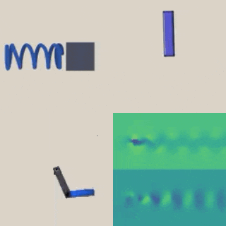

# Automated Discovery of Continuous Dynamics from Videos

[Kuang Huang*](),
[Dong Heon Cho*](http://dc3042.github.io),
[Boyuan Chen](http://boyuanchen.com/)

*These authors contributed equally to this work.
<br>
Duke University
<br>


### [Project Website](http://generalroboticslab.com/SmoothNSV) | [Video](https://youtu.be/4WcVoyspTw0?si=YacImYAG67KXJzKh) | [Paper](https://arxiv.org/abs/2410.11894)

## Overview
This repo contains the PyTorch implementation for our paper "Automated Discovery of Continuous Dynamics From Videos".



## Citation

If you find our paper or codebase helpful, please consider citing:

```
@misc{huang2024automateddiscoverycontinuousdynamics,
      title={Automated Discovery of Continuous Dynamics from Videos}, 
      author={Kuang Huang and Dong Heon Cho and Boyuan Chen},
      year={2024},
      eprint={2410.11894},
      archivePrefix={arXiv},
      primaryClass={eess.SY},
      url={https://arxiv.org/abs/2410.11894}, 
} 
```

## Content

- [Installation](#installation)
- [Outputs](#outputs)
- [Data Preparation](#data-preparation)
- [Reproducing Results](#reproducing-experimental-results)
- [Model Full Name](#model-full-name)
- [Configuration File](#configuration-file)
- [Viewing Results For Individual Models](#viewing-results-for-individual-models)
- [Training and Testing Individual Models](#training-and-testing-individual-models)
- [License](#license)

## Installation

The installation has been test on Ubuntu 22.04 with CUDA 12.4. All the experiments are performed on one RTX A6000 Nvidia GPU.

Create a python virtual environment and install the dependencies.
```
virtualenv -p /usr/bin/python env3.10
source env3.10/bin/activate
pip install -r requirements.txt
```

The installation time is less than 10 minutes.

## Outputs

We first introduce the naming convention of the saved files so that it is clear what will be saved and where they will be saved.

1. Output folder naming convention:
    ```
    outputs/{dataset_name}
    ```
2. Inside the logs folder, the structure and contents are:
    ```
    \outputs/{dataset_name}
        \logs                          [saved logs]
            \{model_full_name}
        \checkpoints                   [saved checkpoints]
            \{model_full_name}
        \predictions                   [saved predictions]
            \{model_full_name}
        \variables                     [saved state variables - test set]
            \{model_full_name}
        \variables_train               [saved state variables - train set]
            \{model_full_name}
        \variables_val                 [saved state variables - validation set]
            \{model_full_name}
        \predictions_long_term         [long term stability outputs]
            \{model_full_name}
        \tasks                         [test results and analysis outputs]
            \{model_full_name}
        \downstream                    [downstream tasks]
            \{model_full_name}
        \summary                       [summary visualizations]
            \{model_full_name}
    ```

## Data Preparation

Save all datasets as ```data/{dataset_name}```, where ```data``` is your customized dataset folder. **Please make sure that ```data``` is an absolute path and you need to change the ```data_filepath``` item in the ```config.yaml``` files in ```configs``` to specify your customized dataset folder if you decide to use a different directory name**.

### Downloading Data

We provide four datasets with their own download links below.

- [spring_mass](https://drive.google.com/file/d/1rEgkIspJFRTybSp4wdcR_JKdJJXk6QH5/view?usp=sharing) (spring mass system)
- [single_pendulum](https://drive.google.com/file/d/1OL9sH_XlqvI3a33FzVosE2V-_JNSFXr_/view?usp=sharing) (single pendulum system)
- [double_pendulum](https://drive.google.com/file/d/1zC-XsMLocUIQvG9O9Q0PUUvlU8fwavoT/view?usp=sharing) (double pendulum system)
- [cylindrical_flow](https://drive.google.com/file/d/1crLKV1gqVIbHF-yHuKIOVftS0FpUU1nI/view?usp=sharing) (cylindrical flow system)

**For the ```cylindrical_flow``` dataset, we utilize a neural network to map the pixel color to a vector field quantity for physics analysis. This model is saved with the dataset as a torchscript file ```cylindrical_flow/c2idx.pt```**

We further provide two additional datasets used for our experiments with their own download links below.

- [double_pendulum_long_sequence](https://drive.google.com/file/d/1K-bQlDASL1Tiz9JYQwcTmh6O6LaktoQ7/view?usp=sharing) (double pendulum system - long sequences for chaos detection)
- [cylindrical_flow_raw]() (cylindrical flow system - raw vector field data)

### Generating Data

We also provide the scripts to generate the ```spring_mass``` and ```single_pendulum``` datasets.

You can generate the corresponding dataset with the following command
```
python utils/data_collect/{dataset_name}/make_data.py
```

The datasets will be saved as ```data/{dataset_name}```.

You must also run the following script to generate the random train, test, validation splits

```
python utils/create_seed.py -dataset {dataset_name} 
```
**If you have updated the ```data_filepath``` item in the ```config.yaml``` files in ```configs``` you must save the generated dataset as ```data/{dataset_name}```where ```data``` is your customized dataset folder**.

For details on generating the ```cylindrical_flow``` dataset, please refer to the README in  ```utils/data_collect/cylindrical_flow```

## Reproducing Experimental Results

### Training and Testing all models for a given dataset and random seed

You can train and test all models for a particular dataset and seed by a single command
```
bash scripts/trial.sh {dataset_name} {seed} {GPU number}
```

Alternatively, a detached screen can be created to run all commands in the background
```
bash scripts/screen_run.sh {dataset_name} trial {seed} {GPU number}
```

The full run time for each random seed ranges from 48 hours to 1 week, depending on the dataset. 

### Summarizing Results from Multiple Seeds

After running the above for all seeds, the averaged results can be achieved by a single command
```
python summarize.py -dataset {dataset_name} -mode {task keyword} {-port {port_number}} {-model_type {base / smooth / noFilter}}
```
The task keywords and their respective summary results are as follows:
- ```id``` : intrinsic dimension
- ```nsv``` : long term rollout accuracy
- ```nsvf``` : long term neural state vector field integration accuracy
- ```nsv_single``` : neural state variable pixel reconstruction error
- ```nsvf_single``` : neural state vector field single step pixel reconstruction error
- ```smoothness``` : average smoothness metric
- ```noFilter``` : long term prediction accuracy comparison between nsvf trained on filtered and unfiltered nsv data
- ```noAnnealing``` : long term prediction accuracy comparison between smooth nsv trained with and without annealing
- ```discrete``` : long term prediction accuracy comparison between nsvf trained as NeuralODE and trained explicitly on finite differences between states
- ```eq```: all identified equilibrium states and their stability for nsvf trained on {model type}

When ```mode``` is set to ```eq```, you can optionally specify the model_type parameter with which nsvf to summarize (```base``` - non smooth neural state variables, filtered; ```smooth``` - smooth neural state variables, filtered; or ```noFilter``` - smooth neural state variables, unfiltered). The default is set to ```smooth```.

A visualization of the results can be viewed through a local browser at http://127.0.0.1:{port_number}, where port number is set to 8002 by default.

All other results are printed in the terminal and visualizations are stored under the ```summary``` sub directory.

### Generating Sample Trajectories and Videos

All trajectory plots and videos shown in Figures 3, 5, 8 and 9 can be recreated by a single command.

```
bash scripts/downstream.sh {GPU number}
```

**Please make sure the models corresponding to the following random seeds have been trained for their respective datasets: (Spring Mass: Seed 4 Single Pendulum: Seed 1, Double Pendulum: Seed 2) by running the [provided script](#training-and-testing-all-models-for-a-given-dataset-and-random-seed)**

All results are stored under the ```downstream/{model_full_name}/near_eq```, ```downstream/{model_full_name}/timeVariation``` and  ```downstream/{model_full_name}/damping```  sub directories.

### Chaos Analysis

We further provide the code to reproduce the results for chaos analysis shared in Section 2.3

First, please make sure all long sequence trajectories have been encoded using the following command. 

```
bash scripts/double_pendulum_chaos.sh {GPU number}
```
**NOTE: The [double_pendulum_long_sequence](#downloading-data) dataset must exist under the ```data``` directory.**

All visualizations and encoded trajectories are stored under the ```downstream/{model_full_name}/chaos``` and ```downstream/{model_full_name}/chaos_specific``` sub directories.

After the script is finished, all chaos analysis plots and visualizations can be reproduced by following the ```double_pendulum_analysis.ipynb``` notebook under the ```utils``` directory.

## Model Full Name

Our approach involves two model groups, which each contain the following models (model_name):

Neural State Variable Autoencoder

- dynamics predictive model (encoder-decoder / encoder-decoder-64)
- latent reconstruction model (base/ smooth)

Neural State Vector Field 

- dynamics model (regress / regressDeeper)

Full Names are generated for each model according to their key hyperparameters.

Smooth latent reconstruction models are automatically saved with the following naming scheme

```
    model_full_name: smooth_{seed}_{reconstruct_loss_type}_{smooth_loss_type}_{smooth_loss_weight}_{regularize_loss_type}_{regularize_loss_weight}_{annealing}
```

Other-wise, Neural State Variable Autoencoder Models are named as follows

```
    model_full_name: {model_name}_{seed}
```

Neural State Vector Field Models are automatically saved with the following naming scheme

```
    model_full_name: {model_name}{-discrete}_{seed}_{nsv_model_name}{_filtered}
```

```-discrete``` denotes which method to train the neural state vector field (NeuralODE or Reconstructing Finite Difference)

```nsv_model_name``` is the model full name for the latent reconstruction model that generated the neural state variable trajectories

```_filtered``` denotes whether or not we filter the data before training.


## Configuration File

All configuration files needed to reproduce the experimental results are included in the ```configs``` folder

### Neural State Variables Autoencoder

Each model has a corresponding configuration file ```{model_name}.yaml``` with the following parameters

```
    #Model Parameters

    seed: 1
    nsv_model_name: "default"
    model_name: 'smooth'
    latent_model_name: 'encoder-decoder-64'

    lr: 0.0005
    if_cuda: True
    gamma: 0.5
    log_dir: 'outputs/logs'
    output_dir: 'outputs'
    num_workers: 8
    lr_schedule: [15, 30, 100, 300, 500]
    input_type: 'high-dim-latent'

    reconstruct_loss_type: 'high-dim-latent'
    reconstruct_loss_weight: 1.0
    margin: 0.1
    smooth_loss_type:  'neighbor-distance'
    smooth_loss_weight: 64.0
    regularize_loss_type: 'sinkhorn'
    regularize_loss_weight: 32.0
    architecture: "default"
    method: "default"
    annealing: True
    model_annealing_list: [['beta', 0, 1.0, 5, 0.5, 'linear']]
    data_annealing_list: [] #[['decay_rate', 0., 0.5, 4, 0.5, 'linear']]
    pretrain_epochs: 0

    #Data Module Parameters

    data_filepath: './data/'
    dataset: 'single_pendulum'
    train_batch: 512
    val_batch: 256
    test_batch: 256
    shuffle: True

    #Trainer Parameters

    num_gpus: 1
    epochs: 1000
    inference_mode: False
    
```

### Neural State Vector Field

Each model has a corresponding configuration file ```{regress / discrete}-{base / smooth}{-filtered}.yaml``` with the following parameters

```
    #Model Parameters

    seed: 1
    nsv_model_name: 'smooth_1_high-dim-latent_1.0_neighbor-distance_64.0_sinkhorn_32.0_True'
    latent_model_name: 'encoder-decoder-64'
    model_name: 'regress'
    reconstruct_loss_weight: 1.0
    pred_length: 56

    lr: 0.0003
    if_cuda: True
    gamma: 0.5
    log_dir: 'outputs/logs'
    num_workers: 8
    lr_schedule: [15, 30, 100, 300, 500]

    #Data Module Parameters

    data_filepath: './data/'
    output_dir: 'outputs'
    dataset: 'single_pendulum'
    decay_rate: 0.5
    train_batch: 512
    val_batch: 256
    test_batch: 256
    shuffle: True
    extra_steps: 0
    filter_data: True
    percentile: 99

    #Trainer Parameters

    num_gpus: 1
    epochs: 1000
    inference_mode: False
    annealing: True
    pretrain_epochs: 0
    data_annealing_list: [['decay_rate', 0.1, 0.9, 4, 0.5, 'linear']]
    
```
```regress``` or ```discrete``` is specified to denote which method to train the neural state vector field (NeuralODE or Reconstructing Finite Difference)

```base``` or ```smooth``` denotes the model name of the latent reconstruction model used to generate the neural state variables

 ```-filtered``` specifies whether or not we filter the trajectories before training.

## Viewing Results For Individual Models

A summary of a particular neural state variable model's results can be generated by the following command
```
python main.py -config {path_to_config} -mode show {-port {port_number}}
```

Similarly, a summary of a neural state vector field model can be generated by the following command
```
python regress.py -config {path_to_config} -mode show {-port {port_number}}
```

A visualization of the results can be viewed through a local browser at http://127.0.0.1:{port_number}. 
Port number is set to 8002 by default.


## Training and Testing Individual Models

### Identifying Neural State Variables

Training and Testing is handled by a single command
```
python main.py -config {path_to_config} -mode {train/test}
```

All necessary tests are built into the testing pipeline such as
- Intrinsic Dimension Estimation
- Smoothness Evaluation (Spline fitting/ Mean Variation)

### Constructing Neural State Vector Fields

Training and Testing is handled by a single command
```
python regress.py -config {path_to_config} -mode {train/test}
```

All necessary tests are built into the testing pipeline such as
- Visualizing Integrated NSV Trajectories
- Visualizing Images from Integrated NSV Trajectories
- Equilibrium Identification and Stability Analysis

All results are stored under the 'tasks' sub directory

### Downstream Tasks

The downstream tasks shown in the paper can be reproduced with a single command
```
python downstream.py -config {path_to_config} -task {task keyword}
```

The task keywords and their respective downstream tasks are as follows:
- damping : synthesize new videos with damping 
- near_eq : sample trajectories near the identified stable equilibrium state
- dt : synthesize new videos with variable frame rate
- chaos : detect chaos (Only for the double pendulum dataset - Must have ```double_pendulum_long_sequence```)

All results are stored under the 'downstream' sub directory


## License

This repository is released under the MIT license. See [LICENSE](LICENSE) for additional details.

## Acknowledgment

This work is supported by ARL STRONG program under awards W911NF2320182 and W911NF2220113, by ARO W911NF2410405, by DARPA FoundSci program under award HR00112490372, and DARPA TIAMAT program under award HR00112490419.
